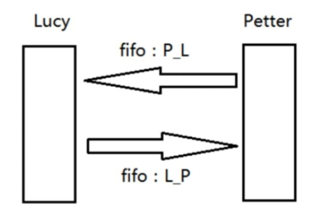
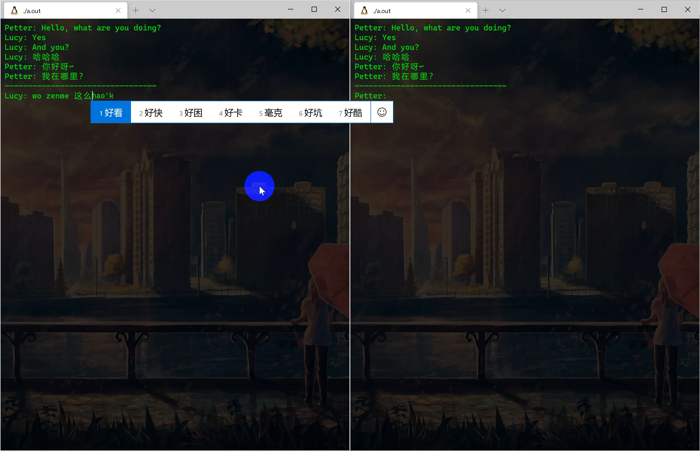

# ChatClient-based-FIFO（基于 FIFO 的单机聊天程序）

## 总体要求

使用命名管道实现进程间通信，使用多进程或者多线程完成读和写的并发，并把聊天的对话记录在文件中。最终实现文字界面的两个进程单机聊天。

1. 使用命令创建两个无名管道：`L_P`、`P_L`。`L_P` 负责把 Lucy 说的话发送给 Petter，`P_L` 负责把 Petter 说的话发送给 Lucy。

   

2. Lucy 与 Petter 分别创建多线程，其中一个线程负责读取命名管道中对方发来的数据，另一个线程负责从键盘读入自己要发送的内容并发送给对方。

## 环境配置

**系统环境：** Ubuntu 18.04

**编译指令：** `g++ -lpthread -o main.o main.cpp`

**执行方式：**

- Lucy: `./main.o Lucy`
- Petter: `./main.o Petter`

**说明：**

- 当前目录下的 `fifo1` 与 `fifo2` 为管道所需创建的文件
- 当前目录下的 `Lucy` 与 `Petter` 分别为两个用户进程保存的完整聊天记录

## 演示教程

[【C++】基于 FIFO 的聊天客户端](https://www.bilibili.com/video/BV14K411N7aR/)：https://www.bilibili.com/video/BV14K411N7aR/

